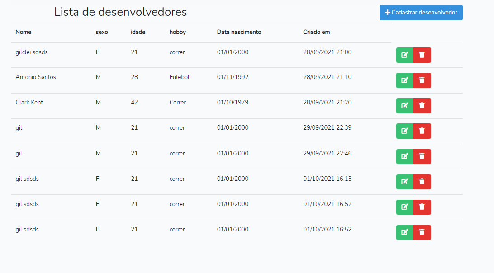

# Cadastro de desenvolvedores


## Sobre <a name = "about"></a>

Projeto de uma API REST em PHP com framework Laravel, que permite criar, ler, atualizar e excluir (GET​, ​POST​, ​PUT​,
DELETE​) registros em um banco de dados, front-end com Vue e Bootstrap. 
Realização de teste unitarios e configuração do docker

Pode-se criar, editar e excluir os desenvolvedores.
Para isso foram criado as telas:
- Listagem de Desenvolvedores;
- Criação/edição da Desenvolvedor;




## Inicio <a name = "getting_started"></a>

Projeto desenvolvido em PHP v7.3, Laravel v8.5 e Vue v2.6

### Pré-requisito

PHP v7.3, Laravel v8.5 e Vue v2.6, composer v2.0 e node v15.0

### API endpoints
```
GET /developers
Codes 200
Retorna todos os desenvolvedores
```
```
GET /developers?filtro=sexo:=:F&per_page=3&ordercolumn=id&order=desc
Codes 200 / 404
Retorna os desenvolvedores de acordo com o termo passado via querystring e
paginação
```
```
GET /developers/{id}
Codes 200 / 404
Retorna os dados de um desenvolvedor
```
```
POST /developers
Codes 201 / 400
Adiciona um novo desenvolvedor
```
```
PUT /developers/{id}
Codes 200 / 400
Atualiza os dados de um desenvolvedor
```
```
DELETE /developers/{id}
Codes 204 / 400
Apaga o registro de um desenvolvedor
```

### Instalação Docker
```
docker-compose up -d
```
### Instalação Manual

- Clone o repositório com __git clone__ executando o comando:
```
git clone https://github.com/gilcleis/research-module.git
```
- Acesse o diretorio criado
- Crie uma copia do arqruivo __.env.example__ nomeando para __.env__ 

- configure as credencias de banco de dados no arquivo __.env__

```
DB_CONNECTION=mysql
DB_HOST=127.0.0.1
DB_PORT=3306
DB_DATABASE=laravel
DB_USERNAME=root
DB_PASSWORD=
```

- Execute o comando:

```
composer install
```
- Execute o comando:

```
php artisan key:generate
```
- Execute o comando:

```
php artisan migrate --seed
```
- Execute o comando :

```
npm install
```
- Execute o comando :

```
npm run dev
```

- Pronto, inicie o URL principal ou:
```
php artisan serve
```

### Testes
```
vendor/bin/phpunit
```